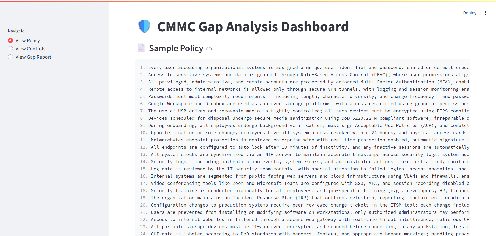
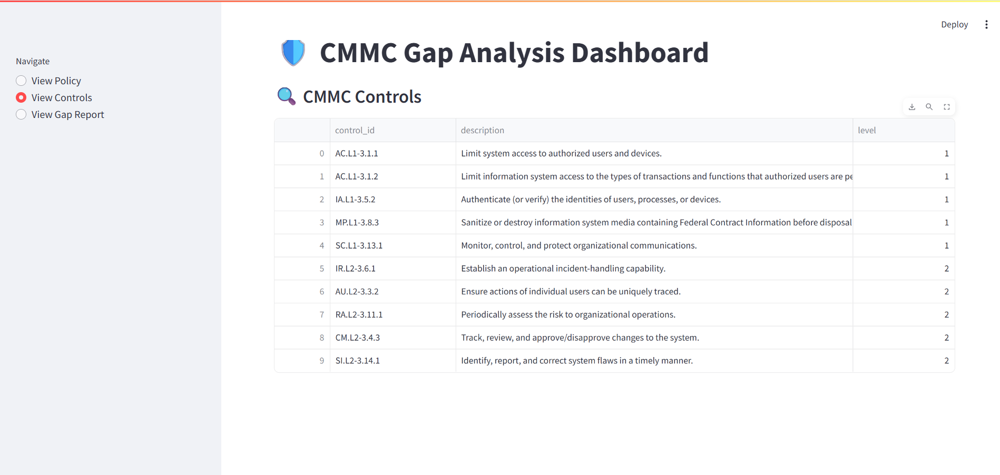
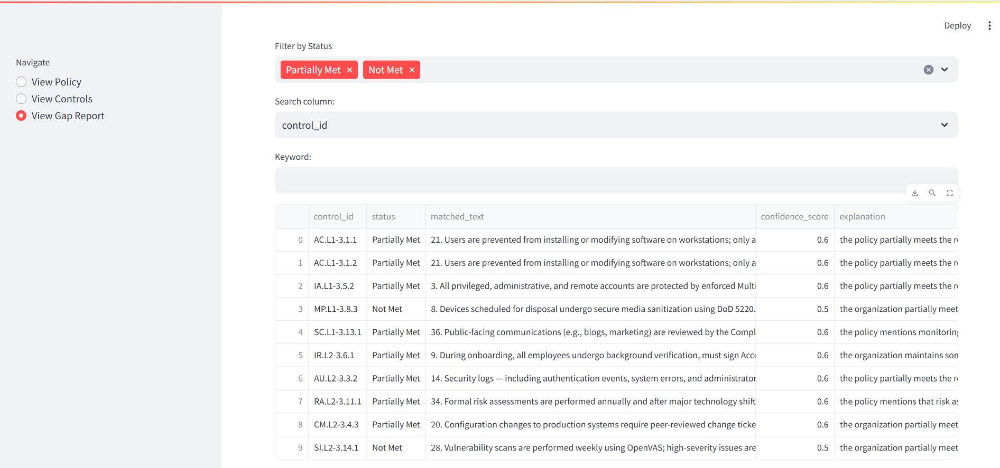

# Gap Analysis Agent: Built with RAG, LLMs and Real-World Compliance Controls

**Trained on CMMC controls. Adaptable to ISO, NIST, and other GRC frameworks.**

[](https://opensource.org/licenses/MIT)

---

## Overview

The Gap Analysis Agent is a lightweight, local-first AI tool designed to automate cybersecurity policy compliance assessments. By leveraging a Retrieval-Augmented Generation (RAG) architecture, it intelligently compares your internal policies against established compliance frameworks.

This agent operates entirely offline, using the **Gemma 2B** LLM (via Ollama) for reasoning, **MiniLM** for local embeddings, and **ChromaDB** for vector storage. It's initially trained based on a sample_policy.txt created from a subset of 110 **CMMC 2.0** controls providing clear, actionable gap analysis reports with status indicators: `Fully Met`, `Partially Met`, or `Not Met`. 
## Key Features

-    **Runs Fully Offline**: No API keys, no data leaves your machine. Ensures total privacy and security.
-    **Transparent & Explainable**: Every finding is backed by matched text from your policy, a confidence score, and a clear LLM-generated explanation.
-    **Lightweight & Efficient**: Optimized to run on standard developer machines (8 GB RAM / 4 GB VRAM).
-    **Highly Adaptable**: While pre-configured for CMMC, its architecture can be easily pointed to other frameworks like NIST, ISO 27001, or custom GRC controls.

---

## How It Works

1.  **Ingestion & Validation**: The agent loads the user-provided policy document and the specified JSON-based control framework.
2.  **Semantic Embedding**: The policy text is chunked and converted into vector embeddings using a local MiniLM model. These are stored in a local ChromaDB instance for fast retrieval.
3.  **RAG-Powered Gap Detection**: For each control, the agent retrieves the most relevant policy chunks from the vector database. These chunks, along with the control description, are passed to the Gemma 2B LLM.
4.  **Reasoning & Analysis**: The LLM analyzes the provided context and determines the compliance status, generating a detailed explanation for its reasoning.
5.  **Reporting & Visualization**: The results are compiled into structured `JSON` and `CSV` reports. An interactive Streamlit dashboard allows for easy filtering, review, and export of the gap analysis.

---

## UI Screenshots

### View Policy
*(Your policy text is loaded and displayed here for easy reference.)*



---

### View Controls
*(Browse the compliance controls the agent is evaluating against.)*



---

### View Gap Report
*(See the detailed, control-by-control analysis with status, evidence, and explanations.)*



---

## Tech Stack

| Technology         | Version/Model      | Purpose                    |
| ------------------ | ------------------ | -------------------------- |
| Python             | 3.11+              | Core application language  |
| LlamaIndex         | 0.10.32            | RAG framework orchestration|
| Ollama             | Gemma 2B           | Local LLM for reasoning    |
| HuggingFace        | MiniLM-L12-v2      | Local sentence embedding   |
| ChromaDB           | 0.4.24             | Vector database            |
| Streamlit          | 1.39.0             | Interactive UI dashboard   |

---

## Getting Started

### Prerequisites

-   **Python 3.11+**
-   **Git**
-   **Ollama**: Ensure Ollama is installed and running. Download it from [ollama.com](https://ollama.com/).
-   Pull the Gemma 2B model:
    ```sh
    ollama pull gemma:2b
    ```

### Installation & Execution

1.  **Clone the repository:**
    ```bash
    git clone https://github.com/yourname/gap-analysis-agent-cmmc.git
    cd gap-analysis-agent-cmmc
    ```

2.  **Install dependencies:**
    ```bash
    pip install -r requirements.txt
    ```

3.  **Embed your policy document:**
    *(This script processes `data/sample_policy.txt` and stores embeddings in `vector_db/`)*
    ```bash
    python embed_engine.py
    ```

4.  **Run the gap analysis:**
    *(This script compares the embedded policy against `controls/sample_controls.json` and generates `outputs/gap_report.json`)*
    ```bash
    python rag_engine.py
    ```

5.  **Launch the UI dashboard:**
    ```bash
    streamlit run ui/streamlit_app.py
    ```
    You can also use the provided batch script on Windows: `run_dashboard.bat`

---

## Project Structure

```text
gap-analysis-agent-cmmc/
├── controls/         # CMMC controls (JSON)
├── data/             # Sample policy text files
├── embeddings/       # (Optional) Backups of embedded chunks
├── outputs/          # Generated gap analysis reports (JSON/CSV)
├── parser/           # (Optional) Preprocessing utilities
├── ui/               # Streamlit dashboard source code
├── vector_db/        # ChromaDB local vector store
├── embed_engine.py   # Script to embed policy documents
├── rag_engine.py     # Script to run the core gap analysis
├── main.py           # Main entrypoint with input validation
├── export_gap_to_csv.py # Utility to convert JSON report to CSV
├── run_dashboard.bat # Quick launcher for the UI on Windows
├── requirements.txt  # Project dependencies
└── README.md         # This file
```

---

## Sample Output (`outputs/gap_report.json`)

```json
{
  "control_id": "AC.L1-3.1.1",
  "status": "Partially Met",
  "matched_text": "All system users must authenticate using MFA when accessing company resources from untrusted networks. User accounts are created by IT upon manager approval.",
  "confidence_score": 0.78,
  "explanation": "The policy enforces MFA, which is a key part of limiting access. However, it does not explicitly state that access is limited only to authorized users, which is a core requirement of the control."
}
```

## Future Roadmap

-   [ ] Bulk control uploads from CSV or YAML files.
-   [ ] Role-based access controls within the UI.
-   [ ] Enhanced UI visualizations (e.g., sunburst charts, heatmaps).
-   [ ] Support for larger local LLMs like Mistral, Mixtral, and Llama 3.

## License

This project is licensed under the MIT License. See the `LICENSE` file for details.

This repository is provided for educational and compliance demonstration purposes only. It is not a substitute for professional legal or compliance advice.

